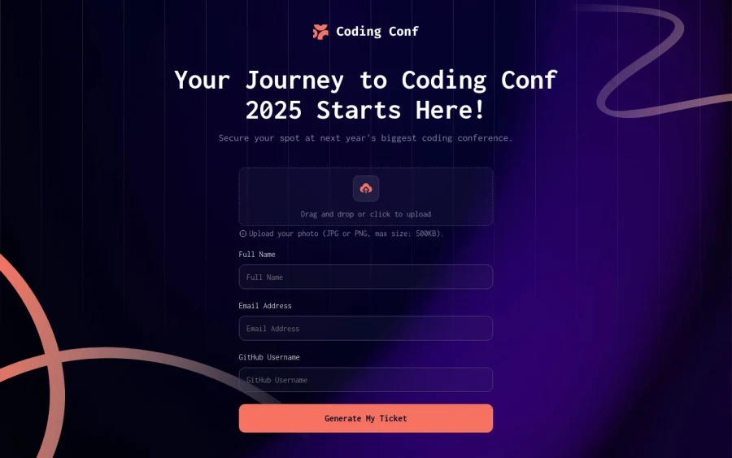

# Frontend Mentor - Conference ticket generator solution

This is a solution to the [Conference ticket generator challenge on Frontend Mentor](https://www.frontendmentor.io/challenges/conference-ticket-generator-oq5gFIU12w).

Frontend Mentor challenges is aimed at improving your coding skills by building realistic projects.

## Table of contents

- [Overview](#overview)
  - [The challenge](#the-challenge)
  - [Screenshot](#screenshots)
  - [Links](#links)
  - [My process](#my-process)
  - [Built with](#built-with)
  - [Author](#author)

## Overview

### The challenge

Users should be able to:

- Complete the form with their details
- Receive form validation messages if:
  - Any field is missed
  - The email address is not formatted correctly
  - The avatar upload is too big or the wrong image format
- Complete the form only using their keyboard
- Have inputs, form field hints, and error messages announced on their screen reader
- See the generated conference ticket when they successfully submit the form
- View the optimal layout for the interface depending on their device's screen size
- See hover and focus states for all interactive elements on the page

### Screenshots

.png>)

**_Mobile view_**

### Links

- Solution URL: [https://github.com/Mr-wilz/Frontend-Mentor]
- Live Site URL: [https://mr-wilz.github.io/Frontend-Mentor/]

## My process

### Built with

- Semantic HTML5 markup
- CSS
- Jquery: Js Library

## Author

Wilfort Abel

- Frontend Mentor - [@Mr-wilz](https://www.frontendmentor.io/profile/Mr-wilz)
- Twitter - [@juicyWhilz](https://www.twitter.com/JuicyWhilz)

- Github - [@Mr-wilz](https://github.com/Mr-wilz)
